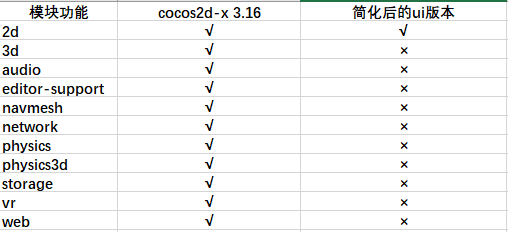
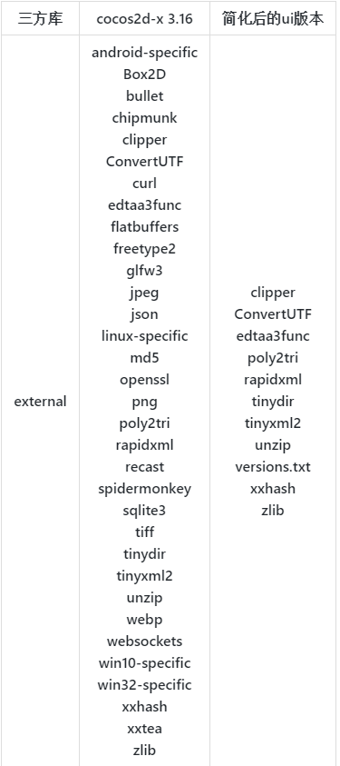

# 精简cocos2d-x 3.16
将cocos2d-x 3.16版本源码进行精简，只保留基础的ui功能，同时删除不必要的第三方库以及将第三方库使用源码代替
同时使用premake代替cmake的构建工具
一下为源码和简化后的对比
  
external库的简化对比  

# 运行测试用例
在windows平台下直接运行premake文件夹下的GenerateProjects.bat脚本，将生产build目录，使用Visual Studio( >=2015 )打开cocos2d.sln工程，将测试用例设置为启动项，编译运行。